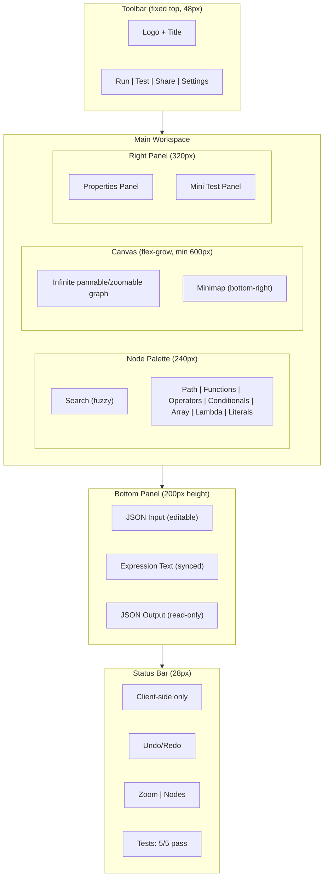

# Visionata Design System

**Aesthetic**: Clinical-Glass hybrid (dark-first, information-dense, translucent hierarchy layers)
**Signature**: Animated data-flow wires pulsing with live evaluation results

---

## Design Principles

**P1: Data Flow is Always Visible** -- Wires animate when data flows. Hovering a wire shows the intermediate value. Selected sub-trees highlight their full data path from root to output.

**P2: Every Node Previews Its Current Value** -- Every node displays a compact preview of its evaluation result, expandable on hover. A `$sum(orders.price)` node shows `324.50`; a path node shows `"John"`.

**P3: Progressive Disclosure Over Feature Dumping** -- Show the minimum for the current context; reveal complexity on demand. Six palette categories, not 40 individual nodes. "Advanced" toggles on properties panels.

**P4: Text and Visual are Synchronized, Not Separated** -- The text expression and graph are two views of the same data. Changes in one instantly reflect in the other. Parallel representations, never separate modes.

**P5: Test Feedback is Immediate and Contextual** -- Testing never requires a separate screen. Pass/fail badges appear on nodes with test cases. The test runner auto-runs on edit. Sub-expression testing via right-click.

**P6: Keyboard-First, Mouse-Friendly** -- Critical paths must be achievable without a mouse. Canvas drag-and-drop must be fluid for mouse users. Both modalities are first-class.

**P7: Zero Server, Zero Trust Required** -- Fully client-side. Persistent "Client-side only" status bar indicator. Import/export via file system APIs or URL encoding, never server endpoints.

---

## Layout Architecture

### Three-Column Workspace

Standard visual programming IDE layout. Three-panel arrangement maps to three cognitive tasks: **navigate** (palette/tree), **compose** (canvas), **configure** (inspector).

### Panel Dimensions and Behavior

All panels are resizable by dragging edges. Double-click a divider to reset to default. Collapsed panels show a thin expand strip. Layout state persists in `localStorage`.

| Panel | Default | Min | Max | Collapse Shortcut |
|-------|---------|-----|-----|-------------------|
| Left sidebar (palette) | 240px | 200px | 400px | Cmd+B |
| Right sidebar (props + test) | 320px | 280px | 480px | Cmd+Shift+B |
| Bottom panel (evaluation) | 200px height | 120px | 400px | Cmd+J |

---

## Visual Language

### Node Type Taxonomy

| JSONata AST Type | Visual Category | Color | Hex | Icon (Lucide) |
|------------------|----------------|-------|-----|---------------|
| `path`, `name`, `variable`, `descendant`, `parent` | Path Access | Blue | `#58A6FF` | Route |
| `function` | Function | Purple | `#BC8CFF` | Sparkles |
| `binary`, `unary` | Operator | Amber | `#D29922` | Calculator |
| `condition` | Conditional | Orange | `#F0883E` | GitBranch |
| `filter`, `wildcard` | Array Operation | Teal | `#3FB950` | List |
| `lambda`, `partial`, `block`, `bind` | Lambda / Higher-Order | Pink | `#F778BA` | Code2 |
| `string`, `number`, `value`, `regex` | Literal / Constant | Gray | `#8B949E` | Quote |
| `sort`, `transform` | Transform / Sort / Group | Cyan | `#39D2C0` | ArrowUpDown |
| `error` | Error | Red | `#F85149` | AlertTriangle |

**Semantic grouping**: Display at a higher abstraction level by default with "expand to AST detail" option. `$.orders.items.price` renders as one node, not four.

### Node Anatomy

- **Left color border**: 3px vertical stripe in the category color (primary identification mechanism)
- **Type icon**: 16x16 SVG icon from Lucide
- **Node label**: Operation name in JetBrains Mono at 13px (e.g., `$sum`, `account.name`)
- **Pass/fail badge**: Small circle, visible only when test cases exist (green = pass, red = fail, gray = untested)
- **Inline value preview**: Compact evaluation result below the label (11px monospace, secondary text color)
- **Input/output ports**: 8px circles on left/right edges, using node category color with white inner dot

**Dimensions**: 180-320px width (auto-sized), 12px padding, 8px border-radius, `--bg-surface` bg, 1px `--border-default` border.

| Node State | Visual Treatment |
|------------|-----------------|
| Default | `--bg-surface` background, `--border-default` border |
| Hover | `--bg-elevated` background, `--border-hover` border |
| Selected | `--border-active` border, blue glow (`0 0 0 3px rgba(88,166,255,0.3)`) |
| Executing | Pulse animation on left color border |
| Error | `--error` border, red glow |
| Disabled | 50% opacity, no interaction |

### Color Palette -- Surface and Text

| Token | Dark Mode (default) | Light Mode |
|-------|-------------------|------------|
| `--bg-canvas` | `#0D1117` | `#FFFFFF` |
| `--bg-surface` | `#161B22` | `#F6F8FA` |
| `--bg-elevated` | `#1C2128` | `#FFFFFF` |
| `--bg-overlay` | `rgba(13,17,23,0.8)` | `rgba(255,255,255,0.8)` |
| `--text-primary` | `#E6EDF3` | `#1F2328` |
| `--text-secondary` | `#8B949E` | `#656D76` |
| `--text-tertiary` | `#484F58` | `#8C959F` |
| `--border-default` | `#30363D` | `#D0D7DE` |
| `--border-hover` | `#484F58` | -- |
| `--border-active` | `#58A6FF` | -- |

### Status Colors

| Token | Hex | Usage |
|-------|-----|-------|
| `--success` | `#3FB950` | Test passing, valid expression |
| `--warning` | `#D29922` | Type mismatch, deprecation |
| `--error` | `#F85149` | Test failing, parse error, invalid connection |
| `--info` | `#58A6FF` | Informational tooltips, help text |

### WCAG Contrast Verification (Dark Mode)

| Element | Foreground | Background | Ratio | Status |
|---------|-----------|------------|-------|--------|
| Primary text on canvas | `#E6EDF3` | `#0D1117` | 13.2:1 | Pass AA |
| Secondary text on canvas | `#8B949E` | `#0D1117` | 4.6:1 | Pass AA |
| Node label on surface | `#E6EDF3` | `#161B22` | 10.8:1 | Pass AA |
| Blue node accent | `#58A6FF` | `#0D1117` | 6.3:1 | Pass AA |
| Error text | `#F85149` | `#0D1117` | 5.6:1 | Pass AA |

Color is never the sole indicator -- always paired with icon AND label (or text).

### Typography

| Role | Font | Weight | Size |
|------|------|--------|------|
| UI Labels | Inter | 400/500 | 13px |
| UI Headings | Inter | 600 | 16-20px |
| Code / Data | JetBrains Mono | 400 | 13px |
| Code Bold | JetBrains Mono | 600 | 13px |
| Status Text | Inter | 500 | 11px |

Fonts loaded from Google Fonts with `display=swap`. Logo wordmark may use Space Grotesk; all in-app text uses Inter + JetBrains Mono.

### Spacing Scale (4px base)

| Token | Value | Usage |
|-------|-------|-------|
| `--space-0` | 0px | Reset |
| `--space-1` | 4px | Tight gaps (within node, icon-to-label) |
| `--space-2` | 8px | Standard gap (form fields, list items) |
| `--space-3` | 12px | Panel padding, section gaps |
| `--space-4` | 16px | Card padding, larger gaps |
| `--space-6` | 24px | Section margins |
| `--space-8` | 32px | Page-level spacing |
| `--space-12` | 48px | Large section separators |

### Motion Tokens

| Token | Value | Usage |
|-------|-------|-------|
| `--duration-instant` | 100ms | Hover states, port highlighting |
| `--duration-fast` | 150ms | Transitions, border color changes |
| `--duration-normal` | 200ms | Node creation, wire connection |
| `--duration-slow` | 300ms | Panel slide, modal open |
| `--easing-standard` | `cubic-bezier(0.4, 0, 0.2, 1)` | General purpose |
| `--easing-enter` | `cubic-bezier(0, 0, 0.2, 1)` | Elements appearing |
| `--easing-exit` | `cubic-bezier(0.4, 0, 1, 1)` | Elements disappearing |

### Border Radius

| Token | Value | Usage |
|-------|-------|-------|
| `--radius-sm` | 4px | Badges, small elements, ports |
| `--radius-md` | 6px | Buttons, inputs |
| `--radius-lg` | 8px | Nodes, cards, panels |
| `--radius-xl` | 12px | Modals, slide-overs |
| `--radius-full` | 9999px | Pills, circular badges |

### Shadows

| Token | Dark Mode | Light Mode |
|-------|-----------|------------|
| `--shadow-sm` | none | `0 1px 2px rgba(0,0,0,0.05)` |
| `--shadow-md` | none | `0 4px 6px rgba(0,0,0,0.07)` |
| `--shadow-lg` | none | `0 10px 15px rgba(0,0,0,0.10)` |
| `--shadow-glow-blue` | `0 0 0 3px rgba(88,166,255,0.3)` | `0 0 0 3px rgba(88,166,255,0.2)` |
| `--shadow-glow-red` | `0 0 0 3px rgba(248,81,73,0.3)` | `0 0 0 3px rgba(248,81,73,0.2)` |

### Z-Index Layering

| Token | Value | Usage |
|-------|-------|-------|
| `--z-canvas` | 0 | Canvas background |
| `--z-wires` | 5 | Wires (below nodes) |
| `--z-nodes` | 10 | Graph nodes |
| `--z-selected` | 20 | Selected nodes/wires |
| `--z-sidebar` | 30 | Side panels |
| `--z-panel` | 40 | Bottom panel |
| `--z-overlay` | 50 | Modals, slide-overs |
| `--z-tooltip` | 60 | Tooltips, popovers |
| `--z-command-palette` | 70 | Command palette (above everything) |

---

## Interaction Patterns

### Canvas Interaction

| Interaction | Implementation | Priority |
|------------|----------------|----------|
| Pan | Middle-click drag, spacebar+drag, two-finger scroll on trackpad | P0 |
| Zoom | Ctrl+scroll, pinch-to-zoom, +/- buttons, Ctrl+0 to reset | P0 |
| Select node | Click node | P0 |
| Multi-select | Shift+click individual nodes; drag-select for box/marquee selection | P0 |
| Fit to view | Button + Ctrl+Shift+F; auto-fit on expression import | P0 |
| Undo/redo | Cmd+Z / Cmd+Shift+Z with per-action granular history (50+ levels) | P0 |
| Minimap | Bottom-right corner, full graph outline with viewport indicator | P1 |
| Zoom to selection | Shortcut to zoom canvas to fit selected nodes | P1 |
| Grid/background | Subtle dot grid at 20px intervals, toggle-able | P2 |
| Lock canvas | Prevent accidental pan/zoom during presentation | P2 |

### Node Creation

| Method | Flow | Target User |
|--------|------|-------------|
| **Palette drag** | Drag from left sidebar to canvas; ghost preview follows cursor; snaps to grid on drop; node appears with scale-up animation (0.9 to 1.0, 200ms); insert inline if dropped on wire | Beginners |
| **Command palette (Cmd+K)** | Search modal appears at top of canvas (Raycast/VS Code style); fuzzy-search node types; Enter places at cursor position | Power users |
| **Drag-from-port** | Drag from output port into empty space; filtered palette appears showing only compatible types; selecting creates node and auto-connects wire | All users |
| **Double-click canvas** | Opens inline search for quick node creation | Power users |
| **Right-click context menu** | "Add node" with categorized submenu | Intermediate users |

Palette search is fuzzy-matched against names and descriptions ("sum" surfaces `$sum`, `$count`, `Add operator`).

### Wire Connection

- **Bezier curves** for all connections (cubic bezier, control points offset 50% horizontal)
- Click output port (grows 8px to 12px, blue glow), drag to input; preview wire follows cursor
- **Type validation**: Incompatible port turns red, dashed red wire. Connection still allowed (dynamic typing) with warning badge
- Valid release: settle animation (150ms). Empty space: fade out (100ms)

| Wire Property | Value |
|---------------|-------|
| Stroke | 2px solid, rounded caps |
| Color (default) | `#30363D` |
| Color (selected) | `#58A6FF` |
| Color (data flowing) | Gradient from source to target node color |
| Animation | Animated dashed stroke (3px dash, 6px gap, 2s cycle via `stroke-dashoffset`) |
| Hover | Thickens to 3px, tooltip shows intermediate value |

Selecting a node highlights upstream/downstream wires in blue; unrelated wires fade to 30%.

### Node Editing

- **Inline edit (double-click)**: Edit label directly on canvas. Enter to confirm, Escape to cancel
- **Properties panel (single-click)**: Right sidebar shows node type header, configuration, live value preview, type badges, docs link, test summary

### Sub-Expression Testing

Based on n8n's "pin data" pattern -- freeze input at any point, iterate downstream.

1. **Select**: Click node, Shift+click, or drag-select multiple nodes
2. **Trigger**: Right-click > "Test Selection" or Cmd+T
3. **Test pane** (right sidebar, below properties): sub-expression text for reference, input pre-filled from last evaluation (editable), expected output field, run + auto-run toggle, diff view, "Save as Test Case" button
4. **Visual feedback**: Sub-tree nodes get blue highlight; diamond boundary indicators where wires cross selection edge

### Text/Graph Synchronization

Not modal -- both always visible. Three layout presets:

| Preset | Shortcut | Layout |
|--------|----------|--------|
| **Graph Primary** (default) | Cmd+1 | Canvas = main area; text in bottom panel (~120px) |
| **Text Primary** | Cmd+2 | Full CodeMirror editor = main area; canvas as minimap in corner |
| **Split View** | Cmd+3 | Canvas and text share main area 50/50 horizontal |

Editing either view updates the other. Text cursor position corresponds to selected canvas node.

---

## Key Screens

### Expression Visualizer

- User pastes a JSONata expression; canvas animates the AST graph with staggered reveal (50ms per node, wires draw after their endpoints appear)
- Auto-layout via Dagre/ELK (left-to-right flow direction), then free repositioning
- Node palette collapsed by default; properties panel shows "Select a node to inspect"
- Click any node to see properties, current value, and highlighted text span
- Entry: paste in bottom panel text editor, or load from URL

### No-Code Builder

- Empty canvas with palette open; ghost text "Drag a node or press Cmd+K"
- Palette organized into 7 categories (Path, Functions, Operators, Conditionals, Array/Object, Lambda, Literals)
- Nodes connect via wire-drawing; text editor updates in real-time as graph is built
- Unconnected nodes show "No input" until wired and input data provided
- Entry: "New Expression" button or fresh workspace

### Test Runner

- **Inline mode**: Right-click node > "Test this node"; docked panel in right sidebar with input, expected, actual, diff, and "Save" button
- **Full expression mode**: Bottom panel three-column live evaluation (JSON input | expression | output)
- Nodes with saved test cases show badge: green filled (pass), red filled (fail), gray outlined (not run)
- Entry: right-click context menu or Cmd+T

### Regression Suite

- Slide-over panel (480px, right-anchored) overlaying canvas without destroying layout
- Test list with Run All, Add Test, pass/fail summary
- Each test: name, input JSON, expression, expected/actual output, status, inline diff
- Auto-run on expression change (500ms debounce); toast notification on new failures
- Entry: "Tests" toolbar button or status bar test summary

### Live Evaluation

- Always-visible bottom panel, three-column split (33% / 34% / 33%)
- JSON Input (editable CodeMirror) | Expression (JSONata syntax, synced with canvas) | JSON Output (read-only, real-time)
- Edit input > re-evaluate (300ms debounce); edit expression > graph + output update; click node > text highlights
- Parse errors in output panel with position indicator; canvas shows last valid state with "Parse error" banner

---

## User Journeys

| Journey | Trigger | Key Steps | Success Metric |
|---------|---------|-----------|----------------|
| **Understand existing expression** | Developer inherits complex JSONata in codebase | Paste expression > view auto-rendered graph > click nodes to inspect > trace data flow | Structure understood in <10 seconds |
| **Build new expression** | Business analyst needs data transformation | Open blank canvas > browse/search palette > drag nodes > connect wires > provide test input | First working expression in <2 minutes |
| **Debug failing sub-expression** | Developer sees error in production JSONata | View error indicators on graph > right-click suspect node > "Test this" > provide input > compare actual vs expected | Failing sub-expression isolated in <30 seconds |
| **Create regression tests** | Team lead safeguarding data pipeline | Define test cases (input + expected output) > Run All > review pass/fail > enable auto-run on edit | Basic test case created in <60 seconds; 20 tests run in <2 seconds |
| **Share with colleague** | Any user needing collaboration | Click Share > copy compressed URL (or export JSON file) > colleague opens link > full workspace restored | Single-click sharing with full state restoration |

---

## Cognitive Load Management

### Node Limits

| Node Count | Assessment | Required Mitigation |
|-----------|------------|-------------------|
| 1-15 | Comfortable; no scrolling needed | None |
| 16-50 | Manageable with pan/zoom | Minimap recommended; collapse optional |
| 51-100 | Challenging; visual clutter | Collapse/expand required; semantic zoom recommended |
| 101-200 | Stressful | Subflow grouping essential; focus mode required |
| 200+ | Hostile | Multi-tab workspaces; aggressive auto-collapse |

Typical complex enterprise JSONata: 20-60 nodes. 100+ is extraordinary.

### Mitigation Strategies

- **Collapse/expand sub-trees**: Toggle collapses children into summary badge (`$map(...3 nodes)`), reducing visible count 60-80%
- **Progressive disclosure**: 6 palette categories; label + icon default, values on hover, full detail in inspector
- **Color coding**: Pre-attentive processing reduces visual search time 40-60%
- **Auto-layout**: Dagre/ELK eliminates layout as a cognitive task
- **Semantic zoom**: Low zoom shows only top-level nodes with summary labels
- **Breadcrumb navigation**: Path shown when inside sub-tree: `Root > $reduce > $map > lambda`
- **Focus mode**: Double-click node to isolate its sub-tree

---

## Accessibility

WCAG 2.1 AA compliance. Text: 4.5:1 contrast. Large text (18px+): 3:1. UI components: 3:1.

### Keyboard Navigation

| Key | Action |
|-----|--------|
| Tab | Cycle focus: sidebar > canvas > properties > bottom panel |
| Arrow keys (canvas) | Move selection to adjacent node |
| Enter | Open properties / confirm inline edit |
| Escape | Deselect / close panel / cancel operation |
| Space | Toggle expand/collapse on selected node |
| Delete / Backspace | Delete selected node(s) or wire(s) |
| Cmd+K | Open command palette |
| Cmd+Z / Cmd+Shift+Z | Undo / Redo |
| Cmd+A | Select all nodes |
| Cmd+C / Cmd+V | Copy / Paste nodes |
| Cmd+T | Test selected node(s) |
| Cmd+B | Toggle left sidebar |
| Cmd+J | Toggle bottom panel |
| Cmd+1/2/3 | Switch layout preset |
| Shift+Arrow | Pan canvas |
| Ctrl+= / Ctrl+- / Ctrl+0 | Zoom in / out / fit to view |
| C (with node focused) | Enter connect mode; arrows to target; Enter to confirm |
| M (with node focused) | Enter move mode; arrows to nudge; Enter to confirm |

### Screen Reader Strategy

The **AST tree view** is the primary screen-reader interface (not the canvas).

| Component | ARIA Strategy |
|-----------|--------------|
| Canvas | `role="application"` with label directing to tree view |
| Tree view | `role="tree"` / `role="treeitem"` with `aria-expanded`, `aria-selected` |
| Nodes on canvas | `role="group"` with descriptive `aria-label` |
| Edges | `aria-hidden="true"` (connections expressed via tree structure) |
| Inspector panel | Standard form semantics; `aria-live="polite"` for value updates |
| Test results | `role="status"` for summary; `role="alert"` for failures |

### Drag-and-Drop Alternatives

| Drag Operation | Keyboard Alternative |
|----------------|---------------------|
| Drag node from palette to canvas | Focus palette item, Enter to place at canvas center |
| Drag wire from output to input | Focus source, C for connect mode, arrows to target, Enter |
| Drag node to reposition | Focus node, M for move mode, arrows to nudge, Enter |
| Drag to box-select | Ctrl+A to select all; Shift+Arrow to extend selection in tree view |
| Drag to pan canvas | Shift+Arrow keys; or use minimap |

### Color Contrast Verification

| Category | Dark BG Color | Text Color | Light BG Contrast |
|----------|--------------|------------|-------------------|
| Path access | `#1E3A5F` | `#1E40AF` | 7.2:1 |
| Arithmetic | `#1A3A2A` | `#065F46` | 7.8:1 |
| String ops | `#2D1B69` | `#5B21B6` | 6.1:1 |
| Array ops | `#3B2710` | `#9A3412` | 6.5:1 |
| Boolean/comparison | `#0F3B3B` | `#115E59` | 6.8:1 |
| Conditional | `#3B3010` | `#92400E` | 5.9:1 |
| Function def | `#3B1016` | `#9F1239` | 6.2:1 |
| Literal | `#2D2D2D` | `#374151` | 8.5:1 |

All categories pass WCAG AA (minimum 4.5:1).

### Reduced Motion

When `prefers-reduced-motion: reduce`: wire animations disabled, node creation instant, staggered reveals instant, panel transitions instant. Hover transitions (100ms) remain.

---

## Heuristic Risk Assessment

| Heuristic | Risk | Key Risk | Mitigation |
|-----------|------|----------|------------|
| H1: Visibility of system status | HIGH | User unsure if evaluation is running/complete | Persistent status bar: parse status, node count, evaluation time, test summary |
| H2: Match system and real world | HIGH | AST terminology unfamiliar to non-developers | Semantic labels ("Filter array") not AST labels ("FilterExpression"); plain-language tooltips on every node |
| H3: User control and freedom | MEDIUM | Accidental node deletion with no undo | 50+ levels of undo/redo; confirmation for destructive actions on connected nodes |
| H4: Consistency and standards | MEDIUM | Inconsistent shortcuts with other tools | Follow platform conventions (Cmd+Z, Cmd+C/V, Cmd+K); follow Figma canvas conventions for pan/zoom |
| H5: Error prevention | HIGH | Invalid wire connections; malformed JSONata paste | Port type validation with warnings; graceful parse error display; confirmation on import overwrite |
| H6: Recognition over recall | HIGH | Must remember JSONata function names to find them | Fuzzy palette search by name AND description; "each item" surfaces `$map`; tooltips show shortcuts |
| H7: Flexibility and efficiency | MEDIUM | Only mouse-based interaction available | Full keyboard navigation; command palette; synchronized dual-mode text/graph editing |
| H8: Aesthetic and minimalist design | MEDIUM | Canvas clutter with many nodes | Collapse/expand; semantic zoom; progressive disclosure (label + icon default, details on demand) |
| H9: Error recovery | HIGH | JSONata errors are cryptic; error location unclear | Error mapped to specific node (red border + icon); human-readable message format: [What] + [Where] + [Fix suggestion] |
| H10: Help and documentation | MEDIUM | No onboarding for first-time users | Three-tier: inline tooltips, interactive tutorial, Ctrl+? help panel with shortcuts and JSONata reference |

---

## Responsive and Theming

- **Dark mode is default** -- developer convention; better node/wire contrast; `prefers-color-scheme` for initial default, user choice overrides
- All colors as CSS custom properties; theme switch swaps token values

Theme toggle via `data-theme` attribute on root. Node type colors adjust lightness between themes; hue families remain consistent.

### Viewport Support

| Viewport | Support Level | Behavior |
|----------|--------------|----------|
| >= 1440px | Full | All panels visible, ideal experience |
| 1024-1439px | Full | Right sidebar auto-collapses, bottom panel shorter |
| 768-1023px | Limited | Single-panel mode: canvas OR text editor, sidebar as overlay |
| < 768px | Minimal | Expression text editor only (no canvas). "Open on desktop for visual editor" message |

Minimum: 1024x768 for the visual builder.

### Touch / Tablet

- Two-finger pan, pinch-to-zoom, long-press for context menu
- All interactive elements: 44x44px minimum touch targets
- Node ports (8px visual) expand to 24px hit area via padding on touch devices
